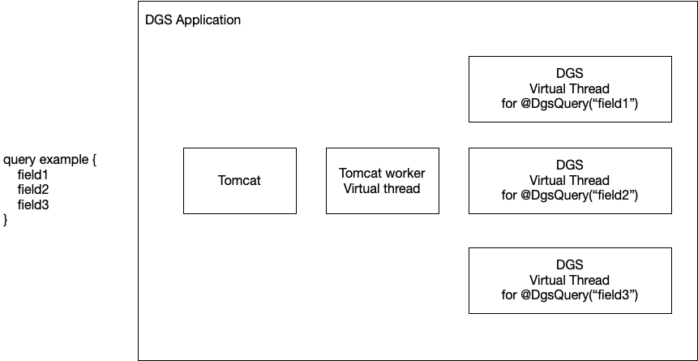

## Datafetching threading model without Virtual Threads

Without virtual threads, the DGS framework does not create or manage threads for data fetchers.
Every data fetcher will run on the same request thread.
This effectively means that data fetchers do not have any concurrent/parallel behavior, except when explicitly returning `CompletableFuture`.
The reason for not having concurrent behavior by default is that this would require using a thread per field, which would not scale well.

To achieve concurrency in data fetchers, you can return `CompletableFuture` from a data fetcher.
A `CompletableFuture` will let you define the `Executor` it will run on, giving you control over managing thread pools.

## Virtual Threads (JDK 21+)

Working with `CompletableFuture` to get concurrent data fetcher behavior isn't ideal for the developer.
It adds complexity to the code, and managing and tuning thread pools can be complicated when running at scale.

With the introduction of Virtual Threads in JDK 21 we no longer have to worry about the scalability limitations of creating threads.
The DGS framework has support for Virtual Threads, which brings concurrent data fetchers out of the box.
Virtual Thread support can be enabled with the following property:

```properties
dgs.graphql.virtualthreads.enabled=true
```

When enabled, each *user defined* data fetcher will run in a new virtual thread.
Because virtual threads don't need thread pool management, you do not need to configure any thread pool.
A "user defined data fetcher" is a data fetcher defined with `@DgsQuery`/`@DgsMutation`/`@DgsData`.
Technically, every field of a POJO also has a data fetcher, but those "trivial" data fetchers will not run in separate virtual threads.

Because each data fetcher runs in its own virtual thread, you get concurrent/parallel behavior out of the box.


!!!note
    Note that data fetchers explicitly returning `CompletableFuture` do not get wrapped in a virtual thread.
    This way you keep the option of managing your own thread pools if needed for your use case.

Spring Framework 6.1 (Spring Boot 3.2) comes with virtual thread support as well.
When using Spring WebMVC on Tomcat, virtual threads can be used for the tomcat work threads.

This is separate from the DGS virtual thread support, but combining the two gives a fully virtual thread based stack, making scaling much easier.

Spring Framework support for virtual threads is enabled with the following property.

```properties
spring.threads.virtual.enabled=true
```

With virtual threads enabled for both DGS and Spring, a request would be processed as follows.



### Threading for data loaders

The Dataloader API requires you to interact with the `CompletableFuture` API.
The `CompletableFuture` API does not allow to change the thread it runs on after creating, so the DGS Framework can't _automagically_ leverage virtual threads.
You are still in control of which `Executor` is used when creating a `CompletableFuture`.
If you want to use virtual threads for a `CompletableFuture`, you can pass a virtual thread based `Executor` as the second argument of many of the `CompletableFuture` factory methods.
DGS provides a virtual threads executor that you can use for this.

```java
@Autowired
@Qualifier("dgsAsyncTaskExecutor")
Executor executor;
```

When creating the `CompletableFuture` you pass in this executor as the second argument of many of the `CompletableFuture` factory methods.

```java
return CompletableFuture.supplyAsync(() -> "My result", executor);
```

### Virtual threading gotchas

Virtual threads work the same as platform threads when it comes to writing code.
When data fetchers run on virtual threads, you might need to take care of context propagation if you store anything on `ThreadLocal`.

When running tests using the `DgsQueryExecutor` you should be aware that the data fetchers run in a different thread from your test.
This can lead to different behavior when using Spring's `@Transactional` for data access.
A `@Transactional` `@SpringBootTest` would normally start a transaction from the test, and roll back the transaction at the end of the test, so that tests don't interfere with each other's data.
Transactional behavior in Spring does not span multiple threads.
Effectively this means that the automatic transaction rollback in tests does not work.
You can fix this issue by either not depending on this behavior in tests (preferred), or disable DGS virtual threads in the `@SpringBootTest` itself.